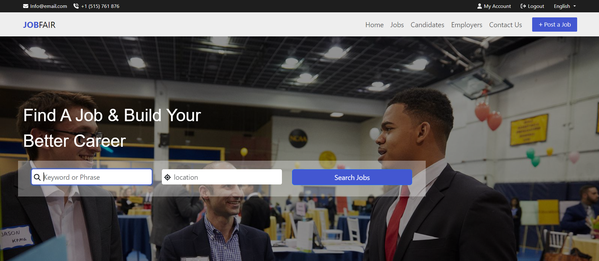

# Job Fair App Readme

## Welcome to the Job Fair App!

This app connects job seekers with exciting opportunities and helps employers find the perfect talent. Whether you're looking for your dream job or seeking skilled candidates, Job Fair has you covered.

  

### Your Guide to the App

This readme explains what Job Fair offers to each user type:

## Job Seekers:

* **Explore listings:** Find your perfect match with filters for job type, date posted, experience, salary range, gender, and qualifications. Search by title or company to narrow down your choices.
* **Showcase your talents:** Create a comprehensive profile highlighting your skills, experience, and education. Easily share your CV with potential employers.
* **Stay organized:** Create candidate lists, bookmark interesting jobs, and track your applications. Stay informed with received messages and access valuable blog posts with career insights.

  

## Employers:

* **Manage your company profile:** Share your story, showcase your open positions, and attract top talent. Update information about your location, industry, and open jobs whenever needed.
* **Find the right fit:** Access a pool of qualified candidates and manage them efficiently. Review resumes, shortlist and accept applicants, and communicate directly through messages.
* **Grow your team:** Post new job openings, attract diverse talent, and expand your workforce. Explore other companies in the listing section and network within the community.

  

### Communication is Key

Companies can directly message candidates through the platform. Candidates can reach out to companies through the "Contact Us" section of their profile.

  

### Still under development:

* Portfolio feature for job seekers is coming soon!
* Changing your user password will be available in future updates.

### ❓ Have questions?

Feel free to contact us through the app or consult our comprehensive FAQs section.

We hope this readme helps you navigate the Job Fair App and achieve your career goals!

  

**Note:** This readme provides a general overview based on your specifications. You may need to modify it further to match your specific app implementation and features.

Remember to update the paths to your images or upload them to the same directory as the readme file. Additionally, you can change the alt text to better describe the content of each image.

  

